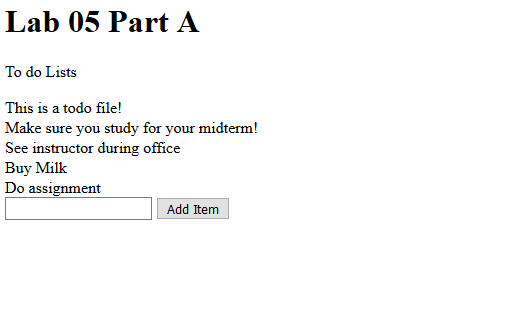

# Lab 04 CSIS 3280 - Functions and Arrays

## Submission Requirements

Please refer to Lab 1 for Submission details including how to properly name and format your zip file and how to use git.  Please remember to do a final commit and not leave any files staging.

Prior to leaving class you must submit your zip file and have the instructor come by and assign a mark.  Failure to submit a zip file prior to leave class will result in a ZERO mark.  Attendance is dependant on your participation in the Lab so please be sure you have submitted and the instructor has come by to assign a mark.

## Lab Assignment

This lab has two parts consisting of the following:

a. In the first part of this Lab you will be required to generate a page that describes at random an emoticon that is in the img/ directory.
b. The second part of this lab will be taking a multi-dimensional array and sorting it by its various attributes (firstname, lastname and email).  You must allow the user to sort via a pull down menu at the bottom of the page.

> Hints:  The following functions may be required that are not covered in the book, you can look these up on php.net, it will help you.
    * define()
    * array_push()
    * number_format()

> For Part B: think about the best way to divide and conquer the problem, work on one small problem at a time.

## Lab Requiremnts

> For this lab you may not move any of the file structures and you must adhere to the following structure:

        --Lab05Rvi_56789
                |--Lab05Rvi_56789.md
                |--Lab05Rvi_56789a.php - Controller file for part A
                |--Lab05Rvi_56789b.php - Controller file for part B
                |-- data/
                    |--todolist.txt
                    |--accounts.csv
                    |--newaccounts.csv -- this is where you need to write the new file to.
                |-- inc/
                    |--html.inc.php -- all HTML generating functions (view)
                    |--todo.inc.php -- all student data (model)
                    |--accounts.inc.php -- all emoticon data (model)
                    |--config.inc.php -- all your pre-defined constants.
                |-- css/
                    |-- style.css - your css file

> You may not mix any of the sorting or generation code between the model and the view, all your html functions should be static, you may pass in the data as arrays.  You may also pass in things like the page title to the html function.

For this lab:
* You may not alter the file structure (above)
* You may not alter any of the function definitions except to add overloading
* You may not move any of the files (above)
* Your html functions must not contain any decision logic only display logic
* Your application must produce simple html (like the example) and it must look exactly the same.

### Part A - Todo App

Write a todo list app.  It should take a todo item and append it to a file, the program is web-based.

Your Part A should look like this:

### Part B - Fixing the accounts

Your accountant came to you with CSV file, the sales team forgot to apply 14% sales tax to their sales.  Use PHP to open the CSV file, add a column for the tax amount and a column for the new total and write the result out.  Be sure to follow the same format and that your application overwrites the new file everytime it is run.  Your program should produce the following output to a file, here is an example of the first three lines:

    92-688-4650,Bradan,Castanyer,bcastanyer0@ihg.com,$50.72,$7.10,$57.82
    15-688-7968,Farah,Rubin,frubin1@cornell.edu,$39.52,$5.53,$45.05
    98-537-3580,Jed,Twitty,jtwitty2@accuweather.com,$55.62,$7.79,$63.41

> Probably best not to modify the original file at all, this can cause issues particularly if there are extra lines in the file etc. this will just cause you problems

Your Part B should display as follows:

### Your Submission

##### Screenshot of Part A

##### Comments on Part A

##### Screenshots of Part B

##### Comments on Part B
Interesting Lab. I got stick on very silly things, that then I was able to resolve. With the new due date extended, is more reasonable to deliver fully working and on time.

# STOP! - This is a pre-assignment submission checklist!

* Did you follow the naming convention for your files?!
* Did you follow the naming convention for your folder?!
* Did you create a ZIP file (compressed folder) as instructed?
* Did you follow the coding and commenting standards?
* Double check **before** submitting.

#### Evaluation of lab and in class assignments

*A note on Labs* - Please be advised most labs will be marked on a sliding scale as they will vary in terms of the amount of artifacts required for submission as well as the difficulty of the lab.  Typically in class labs are marked as follows unless otherwise specified.

| Mark | Comment |
| --- | --- |
| 1 - Partial | Lab partially complete, minimal understanding and execution and concepts demonstrated items missing or incomplete from submission. |
| 2 - General | Lab mostly complete requirements, minor errors present, full submission. |
| 3 - Full | Lab fully complete, concepts and execution demonstrate mastery.  No errors present in submission. |

 Please be sure to follow the Markdown convention and that your document is formatted properly.  There are a few variations of the Markdown format but I will generally be using VSCode to view your files.
